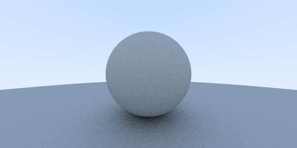

# smallrt-java
simple, small ray tracing in Java

Inspired by 
- [smallpt](http://www.kevinbeason.com/smallpt/)
- [raytracinginoneweekend](https://github.com/petershirley/raytracinginoneweekend)

- The C++ version output is here:

- But current I can only get this in Java
