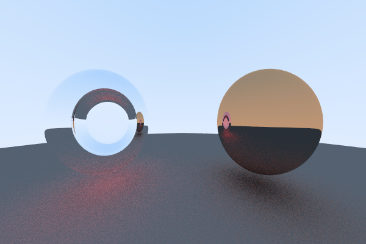

# smallrt-java
simple, small ray tracing in Java

Inspired by 
- [smallpt](http://www.kevinbeason.com/smallpt/)
- [raytracinginoneweekend](https://github.com/petershirley/raytracinginoneweekend)

- Diffuse + Specular

- Diffuse + Refract

- Refrafct

- Diffuse + Refract + Specular

- Solid Texture

